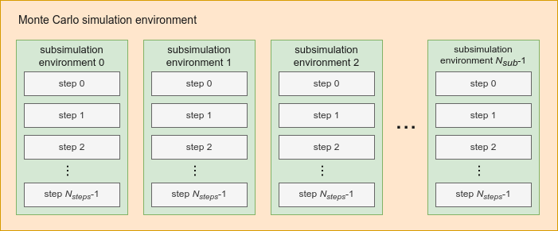

Basic notions and ideas
=======================

Monte Carlo Simulation
----------------------

Monte Carlo Simulation is a class of methods that consist of executing a stochastic process several times to obtain numerical results about it.

Basic ideas of PyMCSL
---------------------

PyMCSL's Monte Carlo simulation has the following components:

* **Monte Carlo Simulation environment**
* **Sub-simulation environment**

A **subsimulation environment** is basically a set of resources used to simulate a stochastic process. A subsimulation environment contains a set of mutable variables, a procedure that initializes the simulation environment and a procedure that simulates the multiple steps of the process. These "steps" are basically the actions taken at each instant of time. At each step of the process, the variables have a state, and the record of states that the variables had at each step along the process is the history of the variables. The history allows us to see the temporal evolution of the variables along the simulation.

A **Monte Carlo simulation environment** is an environment composed of multiple independent subsimulation environments. All nested subsimulation environments have the same set of variables, the same initialization procedure, and the same step procedure, but the subsimulations must run independently, that is, without influencing each other. After executing all subsimulations, the history of each subsimulation is stored within the Monte Carlo simulation environment so that the results are later compiled.

Basic usage of PyMCSL
---------------------

Basic code structure
++++++++++++++++++++

.. code-block:: python

  import pymcsl as mcs

  env = mcs.MonteCarloSimulationEnv(
    variables=[ #environment variables list
    #variables must be declared as tuples in the format (name, type, default value).
    #only int, float, str and bool types are allowed for variables
        ('var1', int, 0),
        ('var2', float, 0.0),
        ('var3', bool, False),
        ('var4', str, 'default'),
        ...
    ],
    n_subsimulations = N_SUBSIMULATIONS, #number of subsimulations
    n_steps = N_STEPS #number of steps per subsimulation
  )

  @env.subsim_begin
  def beginf(context: ContextType):
    """
    Params:
      context (ContextType) - object that gives read and write access to all the current states of the variables.
    """

    """
    code to be executed before the first subsimulation step.
    """

  @env.subsim_step
  def stepf(context: ContextType, step: int):
    """
    Params:
      context (ContextType) - object that gives read and write access to all the current states of the variables.
      step (int) - step index (starting at 0).
    """

    """  
    code to be executed at each subsimulation step.
    """

  if __name__ == '__main__':
    env.run() #run the simulation
    
    """
    code to be executed after the simulation.
    """

The Monte Carlo simulation environment is defined by the **MonteCarloSimulationEnv** class. This class handles running the set of subsimulations and getting the final compiled results.

The subsimulation environment is defined by the **SubSimulationEnv** class. This class handles the variables, states and execution of a subsimulation. It is not necessary to deal directly with this class to do Monte Carlo simulations, as it is used internally by the MonteCarloSimulationEnv class.

The simulation environment variables, which are declared in the **MonteCarloSimulationEnv** class constructor, are all the variables whose results you want to observe after the simulation. The states of these variables throughout the simulation are recorded in state histories, which can be obtained after the simulation through the **MonteCarloSimulationEnv** class methods.

Context objects
+++++++++++++++

In the body of the **beginf** and **stepf** methods, the variables must be accessed through the context object.

The current state of a variable can be accessed in the following ways:

.. code-block:: python

  context.var1 = 10 #set the current state of var1 as 10
  context.var2 += 5.0 #increment 5.0 to the current state of var2
  x = context.var3 #copy the current state of var3 to x

If you want to access variables with dynamic names, or if you want to access a variable whose name is not allowed as an attribute name, the **getstate** and **setstate** methods can be used.

.. code-block:: python

  context.setstate('var1', 10) #set the current state of var1 as 10
  x = context.getstate('var3') #copy the current state of var3 to x

if you want to get the past states of the variables, you can use the **past** method to get a context with past states.

.. code-block:: python

  x1 = context.past(1).var1 #read the state of var1 from 1 step back
  x2 = context.past(2).var1 #read the state of var1 from 2 steps back
  x3 = context.past(3).var1 #read the state of var1 from 3 steps back

Note: the context object returned by the **past** method is read-only.

If you want to use an object of a class or any other data that is not a variable, you can create an auxiliary attribute.

.. code-block:: python

  context.myobj = MyClass() #creates a MyClass object and puts it in an auxiliary attribute 'myobj'.

Auxiliary attributes can be created at any stage of the simulation, do not need to be previously declared (as variables do), and are dynamically typed. Also, auxiliary attributes do not have a state history record.

Obtaining results
+++++++++++++++++

The **MonteCarloSimulationEnv** class has methods to get results after simulation. See the tutorials and **MonteCarloSimulationEnv** class documentation for more information.